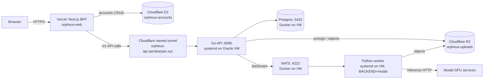

# Orpheus — Deployment & Status Handoff

_Last updated: 2026-08-24. Branch of record: `main`._

This document is the single source of truth for **what is deployed, where it runs, and how to
bring it back up**. It contains **no secret values** — only the names of the stores that hold them.

---

## 1. Current status at a glance

| Stage | State | Evidence |
|-------|-------|----------|
| 1. Modal GPU services | Deployed + auth-gated | 8 services live; 401 on bad shared secret |
| 2. Backend E2E on live Modal | Passing | Full Go `internal/e2e` suite green against the real Python worker + Modal |
| 3. Frontend on Vercel | Deployed | Production deployment public; account store on Cloudflare D1 |
| 4. Deployed-UI E2E | Passing | signup(provision) -> upload(R2) -> transcribe(Modal) -> COMPLETED, over the live public URL |
| 5. Permanent backend | Live | Go API + worker as systemd services on the Oracle VM behind a named Cloudflare tunnel |

**Everything is on allowed services only: Modal + Cloudflare (R2/D1/named Tunnel) + Vercel + the
Oracle Always-Free VM.** The backend is no longer ephemeral — it survives reboots.

---

## 2. Architecture (as deployed)


```mermaid
flowchart LR
  Browser -->|HTTPS| Vercel[Vercel: Next.js BFF<br/>orpheus-web]
  Vercel -->|accounts CRUD| D1[(Cloudflare D1<br/>orpheus-accounts)]
  Vercel -->|/v1 API calls| Tunnel[Cloudflare named tunnel<br/>orpheus-api.sanskarpan.xyz]
  Tunnel --> API[Go API :8090<br/>systemd on Oracle VM]
  API --> PG[(Postgres :5432<br/>Docker on VM)]
  API -->|presign / objects| R2[(Cloudflare R2<br/>orpheus-uploads)]
  API -->|JetStream| NATS[NATS :4222<br/>Docker on VM]
  NATS --> Worker[Python worker<br/>systemd on VM, BACKEND=modal]
  Worker -->|objects| R2
  Worker -->|inference HTTP| Modal[Modal GPU services]
```

- **Frontend (permanent):** Vercel project `orpheus-web` (production `orpheus-web-mu.vercel.app`).
  Deployment protection is off so it's public. `ORPHEUS_API_URL` points at the named tunnel URL.
- **Account store (permanent):** Cloudflare **D1** database `orpheus-accounts` (table `accounts`).
  Passwords are `scrypt`; the org owner-key is AES-256-GCM encrypted at rest with a key derived
  from `SESSION_SECRET`.
- **Object storage (permanent):** Cloudflare **R2** bucket `orpheus-uploads`. The BFF performs the
  presigned part PUTs server-side, so the browser never talks to R2 directly (no browser CORS
  dependency; a CORS rule for the site origin is set anyway).
- **Inference (permanent):** **Modal** workspace `sanskarpandey2004`, 8 services (below).
- **Backend compute (permanent):** Go API + Python worker run as **systemd services on the Oracle
  Always-Free ARM VM** (`alfred-arm`), alongside Postgres/NATS/Redis/MinIO in Docker. The API is
  exposed to Vercel through a **named Cloudflare tunnel** (`orpheus-api.sanskarpan.xyz`), which
  gives a stable HTTPS hostname that survives restarts. See §5.

---

## 3. Modal services

Workspace `sanskarpandey2004`. Deploy with `modal deploy infra/modal/<file>.py`. Endpoints follow
`https://sanskarpandey2004--orpheus-<app>-<fn>.modal.run`.

| App | File | Endpoint fn | Purpose |
|-----|------|-------------|---------|
| orpheus-transcribe | `orpheus_transcribe.py` | `transcribe` | faster-whisper ASR |
| orpheus-align | `orpheus_align.py` | `align` | torchaudio MMS_FA forced alignment |
| orpheus-diarize | `orpheus_diarize.py` | `diarize`, `embed` | ECAPA diarization + speaker embedding |
| orpheus-embed | `orpheus_embed.py` | `embed` | all-MiniLM sentence embeddings |
| orpheus-senses | `orpheus_senses.py` | `analyze` | SenseVoice emotion/events |
| orpheus-enhance | `orpheus_enhance.py` | `enhance` | SpeechBrain MetricGAN+ enhancement |
| orpheus-tts | `orpheus_tts.py` | `synth` | Kokoro TTS |
| orpheus-llm | `orpheus_llm.py` | `serve` (`/v1`) | vLLM OpenAI-compatible LLM |

**Auth:** every endpoint checks `payload.token == ORPHEUS_MODAL_SHARED_SECRET`, injected from the
Modal secret **`orpheus-modal-auth`**. If the secret is rotated, containers must cold-start (or the
app must be redeployed) to pick up the new value, and the local backend env must be re-synced to the
new value or worker jobs 401.

---

## 4. Where secrets live (values NOT in this doc or in git)

| Secret | Lives in |
|--------|----------|
| Modal shared secret | Modal secret `orpheus-modal-auth`; `~/.config/alfred/env` + the backend EnvironmentFile |
| R2 access key / secret, Cloudflare API token, D1 id | `~/.config/alfred/orpheus-cutover.env` (chmod 600) + Vercel env vars |
| Cloudflare DNS-capable token (for the tunnel CNAME) | `~/.config/alfred/orpheus-cutover.env` (`CLOUDFLARE_DNS_TOKEN`) |
| Vercel token | `~/.config/alfred/orpheus-cutover.env`; not stored in repo |
| Platform-admin API key (`ORPHEUS_ADMIN_KEY`) | Postgres (`api_keys`) + Vercel env + `~/.config/alfred/orpheus-admin-key.txt` |
| `SESSION_SECRET` | Vercel env (must match so D1 org-keys decrypt) |

The systemd EnvironmentFile is `~/.config/alfred/orpheus-backend.env` (chmod 600). No tokens are
committed.

---

## 5. The permanent backend (systemd on the Oracle VM)

The backend runs on the Oracle Always-Free ARM VM `alfred-arm`. Three systemd units (all
`enabled`, so they start on boot), plus the Docker infra (all `restart: unless-stopped`):

| Unit | What | Notes |
|------|------|-------|
| `orpheus-api` | Go API on `:8090` | binary at `/home/ubuntu/alfred/bin/orpheus-api` |
| `orpheus-worker` | Python worker | `uv run --package orpheus-workers python -m orpheus_workers.worker`, `BACKEND=modal` |
| `orpheus-tunnel` | cloudflared | named tunnel `orpheus-api` -> `http://localhost:8090` |

Infra containers: `orpheus-postgres` (`:5432`), `orpheus-nats` (`:4222`), `orpheus-redis`
(`:6379`), `orpheus-minio` (`:9000-1`, not used in prod — storage is R2). All heavy inference is on
Modal; the worker is an HTTP client at runtime, so the VM does no GPU/model work (keep every stage
`BACKEND=modal` or the box will try to load torch/whisper and run out of RAM).

Operational commands:

```
sudo systemctl status  orpheus-api orpheus-worker orpheus-tunnel
sudo systemctl restart orpheus-worker            # also re-syncs the processor catalog
sudo journalctl -u orpheus-api -f
```

Config comes from the EnvironmentFile `~/.config/alfred/orpheus-backend.env` (infra + Modal URLs +
R2 + `ORPHEUS_OTEL_TRACES_EXPORTER=none`). Rebuild the API with
`GOFLAGS= /usr/local/go/bin/go build -o /home/ubuntu/alfred/bin/orpheus-api ./apps/api/cmd/api`
then `sudo systemctl restart orpheus-api`. An admin key is minted with
`/home/ubuntu/alfred/bin/orpheus-bootstrap-admin "<dsn>"`.

The named tunnel is a Cloudflare **remotely-managed** tunnel (`orpheus-api`) created via the CF API;
its run token is in `/etc/cloudflared-orpheus.env`. Ingress routes `orpheus-api.sanskarpan.xyz` ->
`http://localhost:8090`; a proxied CNAME in zone `sanskarpan.xyz` points the hostname at the tunnel.
Bot Fight Mode on the zone blocks the literal `Python-urllib` User-Agent (HTTP 1010); the Vercel BFF
(node/undici fetch) is unaffected.

---

## 6. Redeploy the frontend (Vercel)

From `apps/web` (project already linked as `orpheus-web`):

1. Ensure Vercel **production env vars** are set (`vercel env ls production`): `ORPHEUS_API_URL`
   (the named-tunnel URL), `ORPHEUS_ADMIN_KEY` (must match a `platform:admin` key in the backend
   Postgres), `SESSION_SECRET`, `ORPHEUS_PLATFORM_ADMIN_EMAILS`, `CLOUDFLARE_ACCOUNT_ID`,
   `CLOUDFLARE_API_TOKEN`, `D1_DATABASE_ID`.
2. `vercel deploy --prod --yes --token <token>` (or trigger a redeploy of the latest production
   deployment via the Vercel API).

The account store is **Cloudflare D1** (`apps/web/lib/accounts.ts`), so signup/login work on
serverless. Signup calls `POST /v1/onboarding/provision` on the backend with `ORPHEUS_ADMIN_KEY` to
create the org + owner key; that key must exist in the backend Postgres or signup fails.

---

## 7. Backend permanence — RESOLVED

Previously the backend ran locally behind an ephemeral quick-tunnel. It now runs permanently on the
Oracle Always-Free VM (§5) — the "run the compose-style stack unchanged, stable URL, no idle-sleep"
option — with storage on R2 and the public entrypoint on a named Cloudflare tunnel. The deployed-UI
E2E (signup -> upload(R2) -> transcribe(Modal) -> COMPLETED) passes over the live public URL.

Free-tier asterisk: Oracle can reclaim idle Always-Free instances, and the ARM shape is ~2 OCPU /
12 GB; it is not an SLA. If the VM is ever lost, the same units + EnvironmentFile bring it back.

---

## 8. Git / issue trail

- Deployment round: issues **#559** (diarize crash), **#560** (serverless account store), **#561**
  (deploy) -> PRs **#562**, **#563**, **#564**; doc handoff **#566**.
- Permanence round: issues **#567** (e2e catalog isolation), **#569** (OTEL exporter env-gate),
  **#571** (this doc).
- Prior round: PRs **#539-#556**, issues **#489-#538**.

---

## 9. Known caveats

- **Keep every stage `BACKEND=modal`.** A local (non-Modal) backend pulls torch/speechbrain and
  would exhaust the VM's 12 GB.
- **Modal shared secret rotation** requires cold containers / redeploy to take effect, and the
  backend EnvironmentFile (+ `~/.config/alfred/env`) must be re-synced or worker jobs 401.
- **Running the `internal/e2e` suite against a shared catalog** used to delete real cataloged
  processors (e.g. `transcribe`) on cleanup; fixed in #567. If an older revision is run, restart the
  worker to re-sync the catalog.
- **Two Postgres on `:5432`** is a dev-machine hazard only; on the VM there is a single Docker
  Postgres. The host instance caveat does not apply here.
